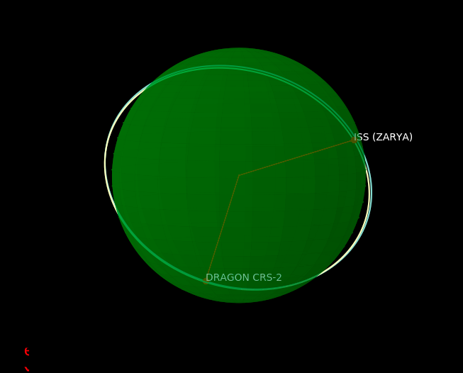
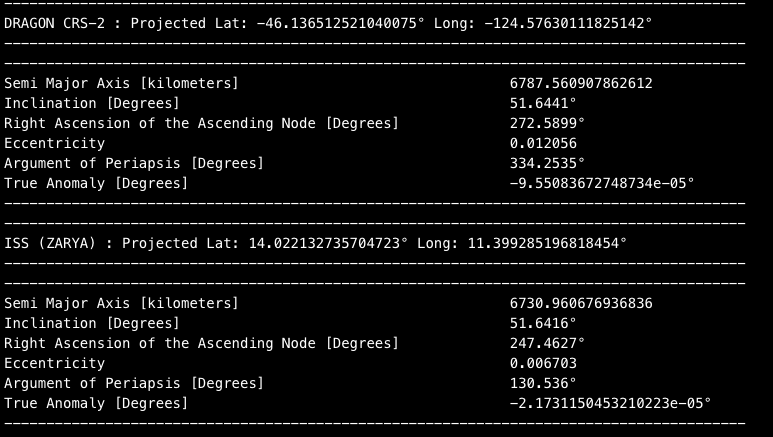

# SpaceMan

SpaceMan is a python package that accomplishes several unique tasks within the space of Astrodynamics. The package gives users the ability to parse satellite Two-Line Element (TLE) Data into its Ballistic, Keplerian, and Satellite Identifying orbital elements. Beyond, this SpaceMan uses a `Matplotlib` 3D plotting toolkit to plot the orbit of the satellites.

# Basic TLE Parser Functionality

```python
from spaceman3D.Orbit import tle, satellites

#Create a class instance of tle()
t = tle()

#Call the draw orbit function
t.tle_satellite_elements(satellites.ISS, satellites.Dragon,print_info=True)
```

# Basic Plotting Functionality

The plotting functionality mentioned below is accessed through the Draw() module.

```python
from spaceman3D.Draw import Draw
from spaceman3D.Orbit import satellites

#Create a class instance of Draw()
d = Draw()

#Call the draw Orbit function
d.draw_orbit(satellites.ISS, satellites.Dragon)
```

Using the code above will output an image that resembles this:



Along with this, by calling the `draw_orbit(element ,print_info=True)` you will print out the keplerian elements used to calculate the satellites trajectory.



## Orbital Mechanic's Resources
I know that I struggled to find resources explaining the mathematics used within Astrodynamics and orbital mechanics, so I have included the "PackageCalculations.txt" file that explains the mathematics behind the functions in Orbit.py and tle.py and the logic behind each function.
